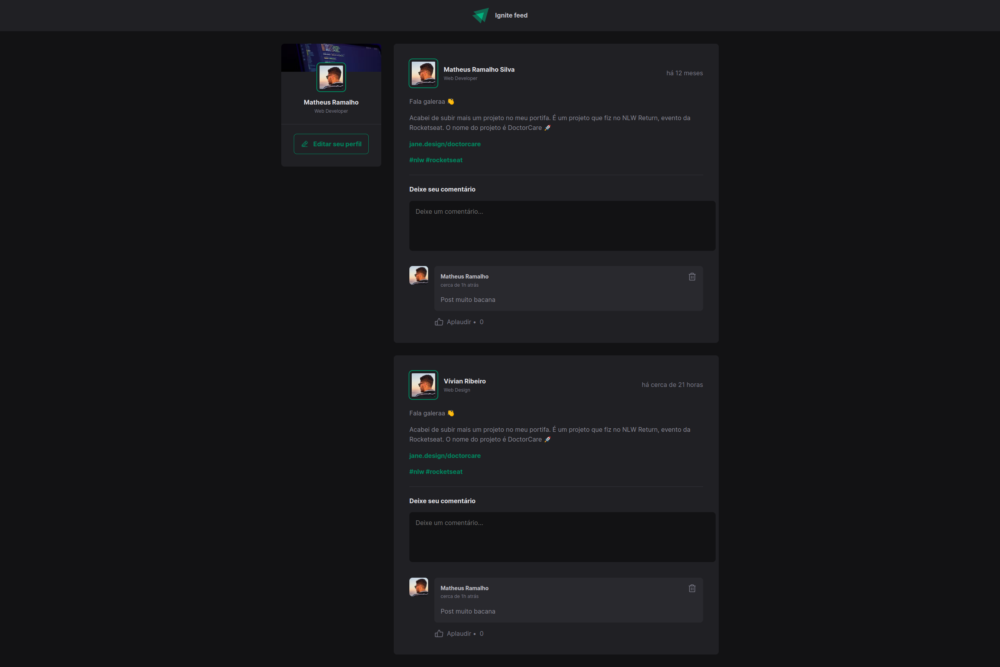

<h1 align="center"> Ignite Feed </h1>

  Primeiro projeto do primeiro módulo do curso de ReactJS dentro do Ignite da Rocketseat.

  <a href="#-tecnologias">Tecnologias</a>&nbsp;&nbsp;&nbsp;|&nbsp;&nbsp;&nbsp;
  <a href="#-projeto">Projeto</a>&nbsp;&nbsp;&nbsp;|&nbsp;&nbsp;&nbsp;
  <a href="#-layout">Layout</a>&nbsp;&nbsp;&nbsp;|&nbsp;&nbsp;&nbsp;
  <a href="#memo-licença">Licença</a>

  

 

  

## 🚀 Tecnologias

Esse projeto foi desenvolvido com as seguintes tecnologias:

- Vite
- React
- TypeScript
- CSS Module
- Git
- Github

## 💻 Projeto

Landinpage de posts e coméntários desenvolvida com conceitos base do React, como state, imutabilidade, componentzação.

## 🔖 Layout

Você pode visualizar o layout do projeto através [DESSE LINK](https://www.figma.com/file/zgDErEmdLUyseIag0fiHMY/Ignite-Feed-(Community)?node-id=0%3A1&t=faCzSwL9SdYtDqAd-1).

## :memo: Licença

Esse projeto está sob a licença MIT.

---

Projeto proposto pela Rocketseat como primeiro projeto do curso de ReactJS  
by Matheus Ramalho - [matheusramalho.dev](matheusramalho.dev)
